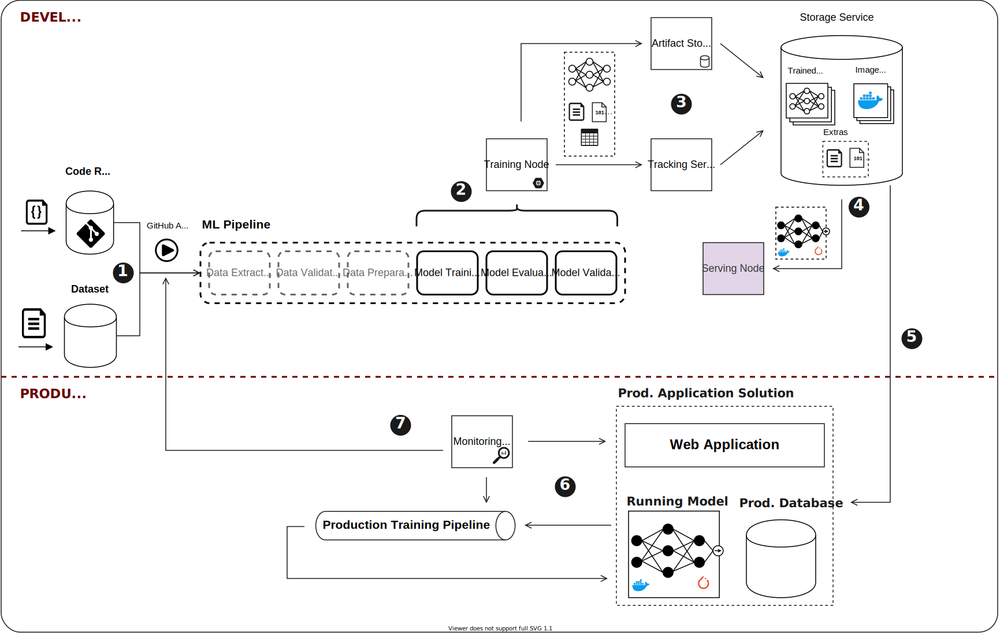

# Operationalizing Pytorch Model with Mlflow

## Context

MLOps is a new buzzword of Software Development. It goes beyond [DevOps](https://en.wikipedia.org/wiki/DevOps) 
by adding a brand new perspective over data and models. In fact, Any reasonable Machine Learning
solution must deal with assets like ML Models, datasets, features, etc. Therefore, a simple ML 
application may turn into a complex workflow in order to ensure the best model runs in Production.
Besides that, developing ML models demands a relevant time assessing and comparing parameters, algorithms
and model performance. MLOps goal is to address these concerns by tying tools and ML frameworks in order to quickly 
deploy models to Production (and keep them there).

PyTorch is one of the main machine learning libraries used in applications such as computer vision and 
natural language processing. It is catching up with TensorFlow accelerating the path from research 
prototyping to production deployment. Recently, Pytorch community announced a number of technical 
contributions to enable end-to-end support for MLflow usage with PyTorch. 

MLflow is an open source platform to manage the ML lifecycle, including experimentation, reproducibility, 
deployment, and a central model registry. One may interact with its components by command line interface
or well-known APIs (Python, R, Java and REST), building a workflow capable of handling development and
production activities. Actually, Its simple design allows small teams (or a lone data scientist as well) 
to rapidly set up a working environment and execute a whole Experimentation and Assesment stage before going 
to formal software development.

In this lab, [MLOps community](https://mlops.community/) wants to test and provide feasible ways 
to build an end-to-end model lifecycle with Pytorch assets and Mlflow.

## Team

- Alexey Naiden
- John Savage
- Michel Vasconcelos
- Varuna Jayasiri

## Repo Organization

The following list describes the most relevant folders in which this lab is organized. Some folders in 
this repo are self-explanatory (like [_imgs_](imgs/)) and therefore aren't mentioned in the list.

* [src](src/): Main source code folder. It comprises all software produced during this lab. _Src_ 
itself is organized into subfolders according to which components it belongs to;
* [docs](docs/): Binary documentation, drawings and reports produced during this lab;

## Proposal
### Design Overview

Our team intend to orchestrate common unix management toolkits (shell commands, ssh, etc), MLFlow
CLI and MLFlow components to build a seamless end-to-end pipeline. It should comprehend 
[Continuous Integration](https://en.wikipedia.org/wiki/Continuous_integration) (CI), 
[Continuous Delivery](https://en.wikipedia.org/wiki/Continuous_delivery) (CD) and 
[Continuous Traning](https://cloud.google.com/solutions/machine-learning/mlops-continuous-delivery-and-automation-pipelines-in-machine-learning) (CT). 
The following figure depicts the proposed architecture.


**Nodes** are bare-metal or virtual machines that host a part of the pipeline process. **ML components** 
are ML-based code that should be trained, tested and deployed by end-to-end pipeline.They must be 
packaged as [MLFlow projects](https://mlflow.org/docs/latest/projects.html). **Training nodes**
host the training process which runs in **Training containers**, running dockerized images built 
with MLFlow and necessary libs to train ML components. Each ML component defines its needs, that is, 
libs and external dependencies. To ensure traceability, provenance and model configuration management, 
one may track hyperparameters, training steps, test results, extra data and the model itself into 
_MLFlow Tracking Server_ hosted in the **Tracking Node**. All these items, metadata and trained models, 
are stored in external resources: RDBMS and Cloud Storage Services. Trained models are embedded into 
dockerized **Serving Instances**, containers running [Torchserve](https://pytorch.org/serve/) providing 
access to the models via HTTP.

In order to provide feedback loop, a **Monitor Node** checks the status and performance meters, issuing 
new training cycles or a full rebuild process. **Control or Operator Machine** is the VM used by Configuration 
Manager or Operation Engineer to follow up the process or issue commands to the nodes in the pipeline. 
This process may run through many different perimeters, however this solution comprises _Development_ and _Production_ 
stages only.

### Architectural Components and Decisions

In this section, we record the (most relevant) design decisions, components selection and the rationale around them.

| # | Subject | Description | Affected Items | Solution | Rationale |
|---|---------|-------------|----------------|----------|-----------|
| 1 | Computing | ML needs processing power as well as GPU. Our architecure relies on distributed elements, thus needing a reasonable number of physical or virtual machines (some with GPU-power) | All Nodes and Machines | GCP Compute Service | It provides $ 300,00 of (enough) free services and we can also spin some gpu-powered machines |
| 2 | Durable Data Storage | Every serious solution needs to store durable data | Tracking Server | Google Cloud SQL | A Postgres Database hosted by Google Cloud SQL is reliable and fast enough for our needs  |
| 3 | Large and Binary Data Storage | ML projects eventually need to store models and extra large files, This type of data doesn't fit in RDBMS | Tracking Server<br>Artifact Store | Google Cloud Storage | Same as #1 |
| 4 | Shipment and Deployment | There are many deployable assets as well as acessory tools that need specific environment and SO libraries to run. Just installing them into a machine isn't a viable option | Training  Node<br>Google Cloud Services | Docker | It's the _de facto_ pattern for shipping and deploying things |
| 5 | Lib Management | Python has a powerful but sometimes confusing and conflicting library ecossystem. Our components may depend on conflicting libs and that will lead to problems in Production | All Nodes and Machines | Pip | Pip is heavily used by Python community. It also work quite well with isolation provided by Docker images |
| 6 | Remote Access | Sometimes we need to issue remote commands or operate a remote machine | All Nodes and Machines | SSH | Hey... It's SSH. There's no need to rationale :-P |
| 7 | CI/CD & Workflow Management | We need to seamlessly integrate and deploy ML stuff. We also have to coordinate the process between nodes | All Items | Github Actions | We're using GitHub, it's heavily used by community and comes off-the-shelf |
| 8 | Project Metadata | We need to describe the ML Component, its structure and how it should run | Source Code Repository<br>Training Node | MLFlow Project Definition | Non-functional Requirement we must adhere |
| 9 | ML Lifecycle Management | We must track the ML Process | All Nodes and Machines | MLFlow |  Non-functional Requirement we must adhere |
| 10 | ML Framework | We are building ML Components. Therefore, we must use a ML framework to train our models | Training Node<br>Serving Instances | Pytorch | Non-functional Requirement we must adhere |


### Workflow

A common ML development workflow should comprise Experimentation, Development and Production stages.
While Development and Production are common stages in Software Development Industry, Experimentation
brings trust to the model being developed. That's a core activity for any serious Machine Learning development. 
During Experimentation, Data Science teams may run various scenarios, compare key metrics and realize 
their progress with model performance before going to Production pipeline. Although MLFlow provides an easy 
path to that stage, our emphasis is on the release process. Experimentation may be addressed in a future work.

The following workflow depicts a common development scenario for our pipeline: a production web application uses a ML
Model to provide business value. 



The first stage is Development Workflow. It concerns the continuous integration of new ML code and Dataset 
changes into a Development Server. Here follows the steps:

1. Commited code or changes in the Dataset fires a training execution. These events trigger Github 
Actions (GH Actions);
 
 1. ML pipeline starts. we are considering that previous data activities (Extraction, Validation and
 Preparation) were already executed. GH Actions issues a _gcloud_ command to _Training Node_, so the 
 ML Component code gets up to date. The ML Component itself describes its structure (_MLFlow project file_) 
 and how it should be run (_Dockerfile_). The MLFlow CLI starts the training process by issuing: 
 ```mlflow run```. The training happens in a GPU-powered Docker container configured with the 
 _Tracking Server_ (```MLFLOW_TRACKING_URI```) . At the end of this step, there's a new trained model 
 with its respective metadata;
 
 1. The Training Node sends the trained model, its extra files, and metadata to the Model Registry
 and Tracking Server respectively. In fact, these assets are physically stored in a Cloud
 Storage Service acessible from Internet;
 
 1. The development workflow ends by deploying the trained model in Google Cloud Run Service. 
 GH Actions creates a new image which contains the trained model (```mlflow create deployment```) which is tagged with the MLflow model name and version and then
 is pushed to Google Container Registry. This image is deployed to a development Cloud Run deployment, where various acceptance tests can be performed to ensure the image is ready for production.

The decision to promote a model to Production happens after some experiments. Model version _X_ is selected. This _external event_ triggers the Production Workflow:

5. Operations and Product Management Team decides to deploy a model to Production environment. A release command is issued, specifying a model name and version to deploy, triggering GitHub Actions. The runner pulls and configures the corresponding Docker image and deploys this to the Production Cloud Run environment

5. The Monitor node tracks how model is performing and periodically starts a local training pipeline
with Production data in order to avoid _Model Erosion_;

5. The model realizes the model doesn't perform anymore (_Model Erosion_) or there are significant 
changes in the data (changes in the data semantic, new relevant fields, etc). It start a feedback
loop triggering a full model rebuild process.

## License
[MIT](https://choosealicense.com/licenses/mit/)
